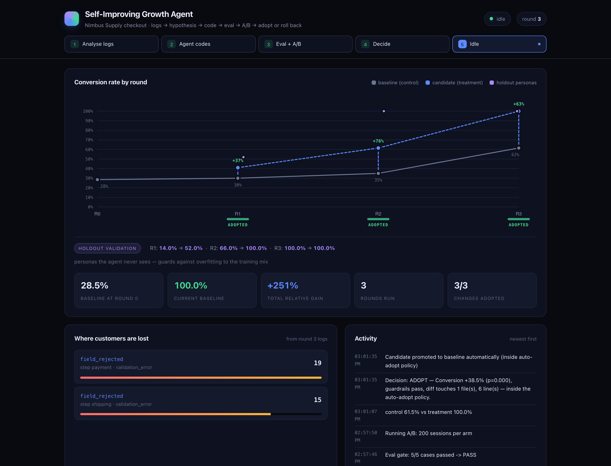

# Self-Improving Growth Agent

A closed loop that improves a real website on its own, and proves the improvement
with a live A/B test rather than asserting it.

```
 logs ──► analyse ──► hypotheses ──► code ──► eval gate ──► A/B (2 live instances)
                                                                    │
        ◄──────── adopt · await approval · roll back ◄── decide ◄────┘
```

Every number in this repository comes from a real browser session against a real
server. Nothing is a mock, and no curve is hardcoded.

**[Read the run report →](https://bz02.github.io/production-rsi/)** — the full
three-round run as one page: every hypothesis, diff, eval-gate result, before/after
screenshot and decision, generated from the run's own artifacts. The pitch deck is
[`docs/Flywheel.pdf`](docs/Flywheel.pdf).

---

## What it actually does

`app/` is **Nimbus Supply**, a small e-commerce checkout funnel
(`landing → product → cart → signup → shipping → payment → confirmation`). It ships
with three defects, planted the way real defects occur — each one looked reasonable
to somebody:

| | defect | how it shows up in telemetry |
|---|---|---|
| **D1** | signup asks for nine fields before you may pay | `abandon_reason: too_many_fields` at `signup` |
| **D2** | checkout is gated behind account creation, no guest path | `abandon_reason: forced_signup` at `signup` |
| **D3** | the pinned mobile total bar covers the pay button | `click_blocked` / `click_intercepted` at `payment`, mobile only |

Each round the agent reads a **summary** of the previous round's logs, proposes
several hypotheses, implements exactly one, and has to clear an eval gate before a
single simulated customer sees it. Then both versions run side by side and the
statistics decide.

**Measured baseline: 28.5% conversion** over 200 sessions (holdout 22.0%), with 64%
of shoppers lost at `signup` and 21% of the survivors lost at `payment`.

Three rounds later, on a run anyone can reproduce with the command below:

| round | change | control → candidate | lift | p | decision |
|---|---|---|---|---|---|
| 1 | cut the signup form to four fields | 30.0% → 41.0% | +11.0pp | 0.021 | **auto-adopted** |
| 2 | add a guest checkout path | 35.0% → 61.5% | +26.5pp | <0.001 | **human approval** — touches `app/server.py` |
| 3 | stop the pay bar covering the pay button | 61.5% → 100.0% | +38.5pp | <0.001 | **auto-adopted** |

Both autonomy paths fire in one run: two CSS/template changes ship unattended, and
the one that edits a route stops for a person. The endpoint is 100% because this
population has exactly three reasons to leave and the loop removed all three — the
numbers to read are the per-round lifts and their p-values, not the ceiling.

---

## Quick start

```bash
pip install flask playwright && playwright install chromium

# round 0 measures the untouched baseline; rounds 1..3 each improve it
python orchestrator/run_loop.py --rounds 3 --n 200 --seed 7

# watch it happen
python dashboard/server.py        # http://127.0.0.1:8080
```



Or let it decide how many rounds it needs:

```bash
python orchestrator/run_loop.py --target 0.55 --max-rounds 6 --n 200 --seed 7
```

Rounds then stop being a budget to spend and become attempts at a number: the loop
keeps proposing, shipping and measuring until the baseline conversion clears the
target, and stops at `--max-rounds` if it cannot — because a loop that cannot reach
its target needs a human to hear about it rather than to keep burning.

Useful flags: `--round N` (one round only), `--rounds N` (a fixed count), `--n`
(sessions per arm), `--auto-approve` (stand in for a human clicking Approve on an
unattended run), `--reset` (clear `data/` and restore `app/` from git),
`--baseline-port` / `--candidate-port` (the arms default to :8000 and :8001 and fall
back to a free port when those are taken, so a machine that already has something on
:8000 does not fail a twenty-minute run), `--workers` (parallel browser sessions per
arm, default 6).

The seed is fixed, so a run reproduces exactly — same personas, same order, same
assignment, and the same result at any `--workers` setting, because each session
draws from a seed derived from its own index rather than from a shared stream. That is a property worth stating out loud rather than hiding: it is what
makes a regression in this loop debuggable.

---

## Layout

```
app/                      the site under improvement — the ONLY tree the agent may edit
candidate/                the agent's working copy, served on :8001 (generated)
personas/personas.json    four rule-based personas, train mix + holdout
sim/simulator.py          Playwright sessions; the sole writer of logs
sim/smoke.py              the eval gate that stands between "code written" and "traffic"
analyzer/analyze.py       funnel, per-persona split, z-test, guardrails, the decision
analyzer/test_stats.py    the decision arithmetic and policy classification, under test
agent/agent.py            the improvement loop: summary in, one code change out
agent/policy.json         auto-adopt allowlist / approval paths / protected paths
agent/test_tools.py       the agent's sandbox, under test
orchestrator/run_loop.py  chains one round together and owns all state
dashboard/                static page + tiny API, polls data/state.json every 2s
data/                     logs, metrics, analysis, per-round artifacts, state.json
docs/build_report.py      renders the run's artifacts into docs/index.html (GitHub Pages)
docs/capture_shots.py     before/after captures, served from each round's own two trees
.github/workflows/ci.yml  both test suites on every push; no browser, a few seconds
```

---

## The five design decisions that matter

**1. A/B is two whole instances, not a feature flag.** Baseline serves `app/` on
:8000, candidate serves `candidate/` on :8001. The agent edits one copy of one tree
and never reasons about flag plumbing, and "roll back" is discarding a directory.

**2. The simulator writes the logs, not the app.** If the app emitted its own
telemetry, an agent editing the app could break instrumentation — or quietly improve
its own numbers. Moving the writer outside the editable tree makes that impossible
rather than merely discouraged.

**3. The agent cannot touch its own evaluator.** `write_file` refuses any path
outside `candidate/`, and the analyzer independently re-checks the round's diff
against `protected_paths` and marks the round `invalid` if it finds a hit. Two
enforcement points, two processes, one test suite each: `agent/test_tools.py` for the
refusal (`../analyzer/analyze.py`, `../personas/personas.json`, `../../etc/passwd`,
`/tmp`, a traversal out of a subdirectory and a symlink leaving the sandbox) and
`analyzer/test_stats.py` for the re-check.

**4. The decision is not the model's to make.** The analyzer computes it, in code:

```
smoke failed or protected path touched  ->  invalid    (roll back)
http error rate rose > 2pp              ->  rollback
lift > 0 and p < 0.10                   ->  adopt, or pending_approval per policy
otherwise                               ->  rollback
```

An agent that could influence its own scoring would have no credibility. The model
chooses *what to try*; arithmetic decides *what survives*.

**5. One hypothesis per round.** The agent proposes three to five and implements the
top one. Attribution stays clean: a lift belongs to a single named change, not a
bundle.

---

## Autonomy: earned per change, not granted once

`agent/policy.json` decides how much rope each change gets, from the diff itself:

- diff confined to `app/templates/**` or `app/static/**`, ≤6 files, ≤150 lines
  → **auto-adopt**, no human involved
- touches `app/server.py`, `app/payment*`, `app/auth*`, or exceeds the limits
  → **pending_approval**, with Approve / Reject buttons in the dashboard
- touches `sim/`, `analyzer/`, `personas/`, `agent/`, `data/`, `orchestrator/`
  → **invalid**, rolled back on principle

So the same loop ships a CSS fix unattended and stops for a human on an auth change.
Both of those have happened for real: round 2 of the recorded run held a +18.0pp win
at `p=0.010` until somebody clicked Approve, because the diff touched
`app/server.py`.

The third rule has never fired in a real round, and that is the point: it is the
mechanism that would catch an agent editing its own scorer, and there is a test for
it precisely because it should never fire by accident. The `invalid` verdict it
shares with the eval gate *has* fired for real, once, and not by design: a change to
`sim/smoke.py` mid-run tightened a contract check, the candidate failed the gate, and
the round was rolled back before a single session ran against it. That is the
behaviour the gate exists for, arrived at by accident — which is a better test of it
than anything written on purpose.

One deliberate addition to the frozen policy: `app/server.py` is listed under
`needs_approval_paths` even though the auto-adopt allowlist already routes it to a
human (it is neither `templates/**` nor `static/**`). The verdict is identical either
way — verified against the spec-literal policy — so this only changes the wording of
the reason the dashboard shows, from "outside the auto-adopt allowlist" to "touches
app/server.py".

---

## Statistics

Two-proportion z-test on the conversion rate (pooled variance for the test, Wald
interval on the absolute difference), with the round's funnel derived from the steps
that actually appear in each arm's logs — never a fixed list, because the agent is
allowed to delete a funnel step and a hardcoded funnel would silently mis-attribute
that round.

Sample size is the thing this loop got wrong first, so it is worth being precise
about. At `n=80` per arm the design detects roughly a 15pp move at `p≈0.05` — and the
first real win it found, the signup trim, is +11pp. Three rounds in a row proposed it
and three rounds in a row lost it to noise (`p=0.177`), while the control arm alone
wandered 23.8% → 27.5% → 33.8% on an app nobody had touched. A loop that cannot
resolve its own wins does not converge; it just churns.

So sessions run in parallel (`--workers`, default 6, results identical at any worker
count) and the default sample is `n=200` per arm, where an 11pp move lands at
`p=0.02`. The gate did its job in both regimes — that is the point: at `n=16` a
genuine +18.8pp came back `p=0.238` and was refused. Underpowered wins are rolled
back, not shipped, so the fix is to buy power, not to lower the threshold.

**Holdout personas** (`senior_tablet`) never appear in the agent's summary and never
influence a decision. They are reported separately on the dashboard as an
overfitting check — if adopted rounds stop moving the holdout, the loop is learning
the training mix rather than fixing the site.

---

## On tooling: why this is self-contained

The obvious reach is for a hosted experimentation platform (GrowthBook, Statsig,
Unleash) and a hosted eval harness (promptfoo, Braintrust, Inspect). For this loop
they were the wrong trade, for three specific reasons:

- **The decision must be local and deterministic.** The gate is four lines of
  arithmetic that has to run identically on every machine and in CI. A network call
  in that position adds a failure mode and buys nothing — the estimator here is the
  same two-proportion z-test GrowthBook's frequentist engine uses for a binomial
  metric, so a number from this analyzer is directly comparable to one from a
  GrowthBook deployment.
- **The agent has no network by design.** Its tools are `read_file`, `write_file`,
  `list_dir`, `run_smoke`. Adding an HTTP client to reach an experiment API would
  punch a hole in the sandbox that makes decision 3 above provable.
- **Reproducibility.** A fixed seed has to reproduce a run exactly. Server-side
  bucketing in a hosted platform is not reproducible from a seed.

What the hosted tools are genuinely better at — long-running experiments across real
deployments, sequential testing under continuous peeking, org-wide metric governance
— is exactly what a two-hour loop against a simulated population does not need.
`sim/smoke.py` keeps a promptfoo-shaped case list (one named case, one assertion, one
verdict per row) so the gate can be lifted into `promptfoo eval` against a real
deployment when there is one, and `analyzer/analyze.py` is the natural seam to swap
for a GrowthBook or Statsig readout if this ever pointed at real traffic.

---

## Where Claude fits

With `ANTHROPIC_API_KEY` set, Claude ranks the candidate hypotheses and writes each
round's rationale (30s timeout, one retry, then fall back). The edits themselves come
from a playbook of parameterised, smoke-tested transforms rather than free-form
generated diffs.

That is a deliberate trade, and worth being explicit about: in a loop whose whole
claim is that it cannot break its own evaluation harness, a free-form patch is the
one thing that could. The model picks *what* to fix from evidence; the playbook
guarantees the edit is well-formed. Without a key, ranking falls back to friction
volume — which is the same order the model picks anyway, because the evidence is not
ambiguous.

---

## What the dashboard shows

- **Conversion curve** by round, control vs candidate, each round labelled with its
  relative lift, adopted rounds banded green and pending ones amber, with the holdout
  numbers on their own row underneath.
- **Where customers are lost** — the friction ranking straight from the logs, by
  distinct sessions rather than raw events, so a retry loop does not outrank a wall
  of shoppers leaving.
- **Every round**: the full hypothesis table (what was proposed, what was
  implemented, what was deferred and why), the eval gate case by case, guardrail
  chips, before/after screenshots at both viewports, and `diff.patch` and `change.md`
  inline.
- **Approve / Reject** for any round the policy reserved for a human.

---

## Tests

```bash
python analyzer/test_stats.py       # decision arithmetic and policy classification
python agent/test_tools.py          # the agent's sandbox
python agent/test_llm.py            # the model call, and its fallback
python orchestrator/test_approval.py  # what Approve and Reject actually do
python orchestrator/test_target.py    # when --target stops, and when it gives up
python sim/test_gate.py             # the eval gate, against deliberately broken candidates
```

The first five need no browser and no server, so they run in CI on every push in a
few seconds. The last one runs a browser and gets its own CI job, because the claim
it checks is not arithmetic.

`test_stats.py` is 20 checks over the arithmetic that decides things: the z-test (including the
interface document's own claim that 30% vs 45% at n=80 lands at p≈0.05), the
degenerate cases, and policy classification from real diff text — including that a
diff editing `analyzer/analyze.py` comes back `invalid`. That last one is what makes
"the agent cannot edit its own scorer" a test rather than a claim — and
`test_tools.py` asserts the other half of it, that `write_file` refuses the path
before anything is written: `..` traversal out of a real subdirectory, an absolute
path, and a symlink pointing out of the sandbox, with the file outside checked
afterwards to confirm it was not touched.

`sim/test_gate.py` is the one test that runs a browser. The eval gate has never
failed in a real round — the playbook only emits well-formed edits, which is the
point of the playbook — so a gate nobody has watched fail is a gate nobody knows
works. It manufactures the failures instead, in temp copies of `app/`: a step with no
forward action, a 500 mid-funnel, and an input the simulator cannot see. Each one has
to be caught by the named case that should catch it, and the intact app still has to
pass.

`orchestrator/test_approval.py` covers the half of the policy that is easy to get
wrong. Stopping for a human is the easy half; what the button then does is the half
that matters — approving promotes *that round's* candidate even when `candidate/` has
since been overwritten by a later round, records that a human decided, and clears the
pending flag on the chart. Approving twice, approving a rejected round and approving a
round that does not exist are all refused rather than half-applied, because the button
lives in a browser and browsers re-send things.

`agent/test_llm.py` covers the model call with a stubbed transport: a good answer is
used, and a hallucinated hypothesis id, prose with no JSON, truncated JSON, an
unreachable API and a missing key all fall back to the heuristic. That fallback is
invisible when it works — a run with a dead key looks like a run without one — so it
is worth asserting that the silence is deliberate.

---

## Reproducing the headline

```bash
python orchestrator/run_loop.py --rounds 3 --n 200 --seed 7 --auto-approve --reset
python dashboard/server.py
```

That run takes about 13 minutes on a laptop (6 parallel workers, 1000 real browser
sessions). `--auto-approve` stands in for the human click that round 2 would
otherwise wait for; drop it to click Approve in the dashboard yourself.

Round 0 establishes the baseline. Each later round should pick the largest remaining
loss in the funnel — which, given the three planted defects, means the form, then the
forced account, then the mobile tap target.
